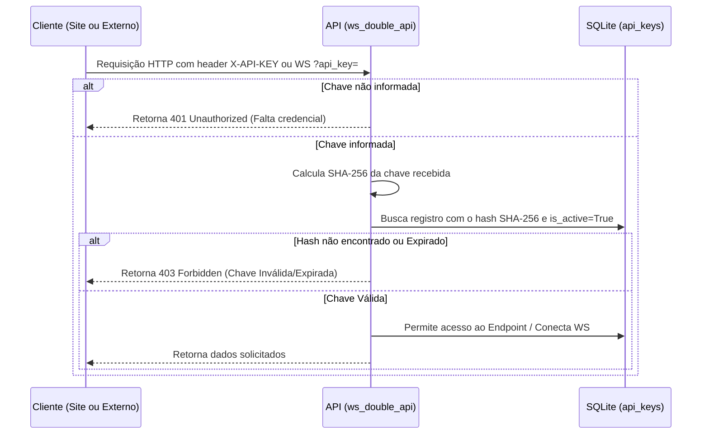

# Plano de Implementação: API Blaze Double Autônoma (ws_double_api)

Este plano descreve a estruturação de uma API autônoma e de alto desempenho para o jogo **Blaze Double**, localizada no diretório [ws_double_api](file:///opt/docker-apps/projects/minhas-apis/ws_double_api). O projeto separa completamente a camada de captação (WebSocket Scraper) e de fornecimento de dados (FastAPI) da aplicação do site ([SITE-VETTIPSTER](file:///opt/docker-apps/SOMENTE-CONSULTA/SITE-VETTIPSTER)), permitindo que ela funcione como um microsserviço independente comercializável (modelo de aluguel).

---

## 🎯 Requisitos Principais e Arquitetura

1.  **Histórico de 10 Dias & Banco Flexível (SQLite / PostgreSQL) via Docker Secrets:**
    *   **Portabilidade de Banco de Dados:** A API suportará tanto **SQLite** (usando `aiosqlite`) quanto **PostgreSQL** (usando `asyncpg`). Isso será controlado de forma transparente através do utilitário `get_secret` e de variáveis não sensíveis (como `DB_H`, `DB_U`, `DB_N`).
    *   **Segurança Estrita com Docker Secrets (Zero .env):** Em conformidade absoluta com a segurança da sua VPS, **nenhum arquivo `.env` ou `.env.example` será criado ou mantido**. Todas as configurações não sensíveis (como `DB_H`, `DB_U`, `DB_N`, `REDIS_HOST`, etc.) serão declaradas diretamente no bloco `environment:` do `docker-compose.yml`. Todas as credenciais e dados confidenciais (senhas de banco de dados, chaves de API secretas, tokens de administração) serão recuperados de forma segura a partir do sistema de secrets do Docker (`/run/secrets/`), mapeando nomes amigáveis para caminhos ofuscados (ex: `s-p-22`, `s-k-99`), exatamente como feito no [evolution-api](file:///opt/docker-apps/projects/evolution-api).
    *   **Armazenamento Resiliente:** Por padrão, utilizaremos o SQLite local por ser portátil e leve (sem credenciais), ou se configurarmos PostgreSQL, compilaremos a URL de conexão dinamicamente na memória usando os secrets de `/run/secrets/s-p-22`. Uma rotina periódica (executada a cada 1 hora) excluirá giros com mais de 10 dias.
2.  **Segurança e Multi-Inquilinato (Aluguel):**
    *   **Tabela de Chaves de API (`api_keys`):** Chaves geradas de forma aleatória e segura. Para máxima segurança, **armazenaremos apenas o hash SHA-256 da chave** no banco.
    *   **Autenticação Dupla:** Tanto as requisições HTTP REST (via header `X-API-KEY`) quanto as conexões de WebSockets em tempo real (via parâmetro de query `?api_key=...`) serão validadas contra o banco de dados.
3.  **Duplo Consumo (Interno e Externo):**
    *   **Externo (Traefik):** Roteamento HTTPS sob o domínio principal da sua API (`api.vettipster.com.br`) na rota com prefixo `/double/v1/results`. Isso é feito adicionando regras específicas de roteamento no Traefik (`Host("api.vettipster.com.br") && PathPrefix("/double")`), o que significa que **nenhum redirecionamento ou alteração de DNS adicional é necessária**, pois `api.vettipster.com.br` já aponta para a VPS e o Traefik cuidará de direcionar o tráfego correto para o container `ws_double_api` de forma automática!
    *   **Interno (Site Dashboard):** O container do frontend/backend do [SITE-VETTIPSTER](file:///opt/docker-apps/SOMENTE-CONSULTA/SITE-VETTIPSTER) consumirá a API diretamente através da rede Docker interna (`http://ws_double_api:8000/double/v1/...`), enviando a chave de API interna predefinida, que será lida de forma segura usando o `get_secret` mapeado para um Docker Secret. Isso garante que a segurança seja mantida de forma homogênea e sem vazamento de dados de configuração.
4.  **WebSocket em Tempo Real robusto:** Broadcast em tempo real de novos giros detectados do WebSocket da Blaze para múltiplos clientes conectados de forma assíncrona com tratamento de desconexão resiliente.

---

## 🏛️ Estrutura de Arquivos Proposta

```
/opt/docker-apps/projects/minhas-apis/ws_double_api/
├── Dockerfile                   # Configuração de build Docker otimizada multi-stage
├── docker-compose.yml           # Definição do container, secrets e volumes
├── requirements.txt             # Dependências da aplicação (FastAPI, websockets, SQLAlchemy, aiosqlite, etc)
├── main.py                      # Arquivo principal FastAPI com lifespans para worker
└── app/
    ├── __init__.py
    ├── core/
    │   ├── __init__.py
    │   ├── config.py            # Pydantic Settings para gerenciar ambiente
    │   ├── security.py          # Lógica de hashing e geração de chaves
    │   └── websocket_manager.py # Gerenciador de conexões WebSocket dos clientes
    ├── db/
    │   ├── __init__.py
    │   ├── models.py            # Modelos SQLAlchemy para Spins e Chaves de API
    │   └── session.py           # Engine assíncrona e SessionMaker para SQLite
    ├── services/
    │   ├── __init__.py
    │   └── blaze_scraper.py     # Worker WebSocket assíncrono resiliente que captura giros
    └── api/
        ├── __init__.py
        ├── dependencies.py      # Dependency Injections para validação de chaves
        ├── routes.py            # Rotas de dados (/results, /stats, /history, WebSocket /ws/live)
        ├── admin.py             # Rotas administrativas de criação/revogação de chaves (X-Admin-Token)
        ├── schemas.py           # Modelos Pydantic para request/response
        └── schemas.py
```

---

## 🛠️ Modelagem de Dados (Banco de Dados)

### Tabela `double_spins` (Giros do Jogo)
*   `id`: Integer (Chave Primária, Autoincremento)
*   `roll`: Integer (Número sorteado: 0-14)
*   `color`: Integer (Cor correspondente: 0=Branco, 1=Vermelho, 2=Preto)
*   `created_at`: DateTime (Indexado, data/hora da inserção UTC)

### Tabela `api_keys` (Controle de Clientes / Aluguel)
*   `id`: Integer (Chave Primária, Autoincremento)
*   `client_name`: String (Nome/Identificador do cliente ou app)
*   `key_prefix`: String (Primeiros 6 caracteres legíveis da chave)
*   `hashed_key`: String (Hash SHA-256 da chave gerada)
*   `is_active`: Boolean (Flag para suspender/ativar o cliente imediatamente)
*   `expires_at`: DateTime (Opcional, data limite para término de aluguel)
*   `created_at`: DateTime (Data de criação do acesso)

---

## 🔒 Lógica de Segurança e Validação de Requisição



---

## 📋 Proposta de Arquivos e Implementações

### [NEW] [Dockerfile](file:///opt/docker-apps/projects/minhas-apis/ws_double_api/Dockerfile)
Build multi-stage leve para Python 3.11-slim, instalando dependências com segurança e rodando com usuário não-privilegiado.

### [NEW] [docker-compose.yml](file:///opt/docker-apps/projects/minhas-apis/ws_double_api/docker-compose.yml)
Define o serviço `ws_double_api`, mapeando o arquivo `db.sqlite3` para um volume Docker persistente (`./data:/app/data`), e expondo a porta `8000`.

### [NEW] [app/db/models.py](file:///opt/docker-apps/projects/minhas-apis/ws_double_api/app/db/models.py)
Modelagem das tabelas `DoubleSpin` e `APIKey` utilizando SQLAlchemy DeclarativeMapping (compatível com a versão 2.0).

### [NEW] [app/core/security.py](file:///opt/docker-apps/projects/minhas-apis/ws_double_api/app/core/security.py)
Lógica para gerar chaves aleatórias legíveis (ex: `vettipster_live_abc123...`) e validar hashes SHA-256 correspondentes.

### [NEW] [app/api/dependencies.py](file:///opt/docker-apps/projects/minhas-apis/ws_double_api/app/api/dependencies.py)
*   `verify_api_key`: Dependência injetável FastAPI para ler o header `X-API-KEY` (ou parâmetro `api_key` na URL para websockets), aplicar o hash SHA-256, buscar a chave no banco de dados e garantir validade.

### [NEW] [app/api/admin.py](file:///opt/docker-apps/projects/minhas-apis/ws_double_api/app/api/admin.py)
Endpoints REST para o administrador do sistema:
*   `POST /api/admin/keys`: Cria uma nova chave de API, salvando o hash no DB e exibindo a chave crua apenas uma vez para o admin. Exige o header `X-Admin-Token` configurado nas variáveis de ambiente.
*   `GET /api/admin/keys`: Lista chaves cadastradas (mostrando apenas o `key_prefix`, `client_name`, status e expiração).
*   `PATCH /api/admin/keys/{key_id}`: Permite alterar expiração ou suspender a chave (`is_active=False`).

### [NEW] [app/services/blaze_scraper.py](file:///opt/docker-apps/projects/minhas-apis/ws_double_api/app/services/blaze_scraper.py)
Worker Socket.IO nativo que implementa:
*   Handshake Engine.IO and ingresso na sala `double_room_1`.
*   Extração inteligente de novos giros evitando duplicidade.
*   Inserção assíncrona em banco via SQLAlchemy.
*   Desparo automático dos novos giros via `WebsocketManager.broadcast`.
*   Backoff exponencial em quedas de rede para contornar bloqueios da Cloudflare.

### [NEW] [app/api/routes.py](file:///opt/docker-apps/projects/minhas-apis/ws_double_api/app/api/routes.py)
Endpoints de dados protegidos:
*   `GET /api/double/results`: Lista os resultados mais recentes.
*   `GET /api/double/stats`: Retorna as estatísticas agrupadas das últimas 24 horas.
*   `GET /api/double/history/{hour}`: Filtro por hora específica do dia.
*   `GET /api/double/fullday`: Histórico completo do dia.
*   `WEBSOCKET /ws/live`: Socket bidirecional seguro que transmite em tempo real novos giros para os consumidores conectados.

---

## 🧪 Plano de Verificação

### 1. Testes Automatizados Locais
*   Criar script de seed para cadastrar chaves administrativas e simular giros históricos.
*   Rodar `pytest` para cobrir a validação de chaves de API válidas, inválidas e expiradas.

### 2. Validação de Desempenho e Conexões
*   Conectar múltiplos clientes ao `ws/live` e verificar se a transmissão é feita de forma simultânea e assíncrona.
*   Medir consumo de memória do SQLite mantendo a limpeza automática ativa.

### 3. Integração com Site Dashboard
*   Simular o consumo do microsserviço através do backend do site utilizando a porta exposta e a chave de rede interna cadastrada.

---

> [!NOTE]
> **Segurança Absoluta das Chaves:** Em conformidade com as melhores práticas de cibersegurança, as chaves geradas em texto cru nunca são mantidas no banco de dados. Um hash SHA-256 é imutável e protege as credenciais de clientes mesmo em caso de dump do SQLite.
