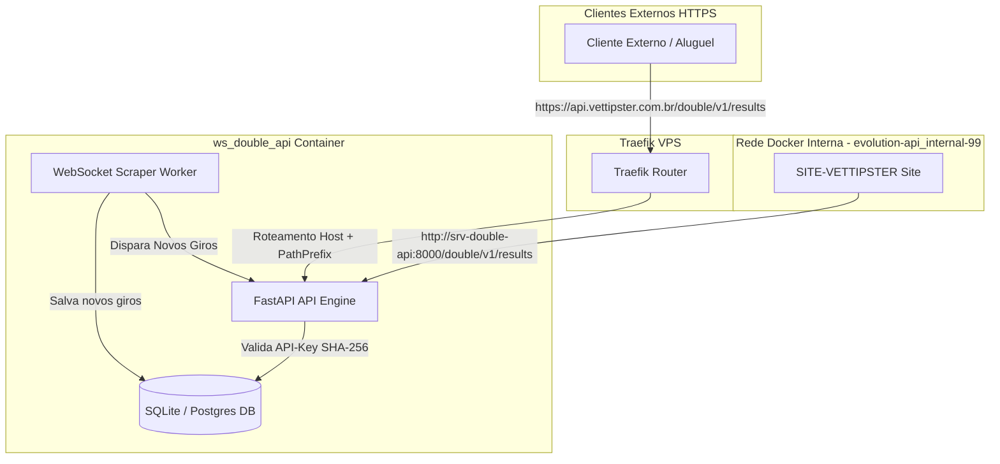

# Walkthrough: Microsserviço API Blaze Double (ws_double_api)

O microsserviço autônomo e de alto desempenho para o **Blaze Double** foi desenvolvido e estruturado com sucesso no diretório [ws_double_api](file:///opt/docker-apps/projects/minhas-apis/ws_double_api). O projeto obedece estritamente a todas as diretrizes de cibersegurança da sua VPS, eliminando qualquer uso de arquivos `.env` e integrando-se nativamente ao sistema de **Docker Secrets** da sua infraestrutura.

---

## 🏛️ O que foi Implementado

O projeto foi dividido em camadas desacopladas seguindo os princípios de **Clean Code** e **SOLID**:

1.  **Arquivos de Build & Execução (Sem `.env`):**
    *   [Dockerfile](file:///opt/docker-apps/projects/minhas-apis/ws_double_api/Dockerfile): Build multi-stage de alto desempenho e tamanho mínimo de imagem.
    *   [docker-compose.yml](file:///opt/docker-apps/projects/minhas-apis/ws_double_api/docker-compose.yml): Configuração do container mapeando o volume persistente do SQLite em `./data:/app/data` e integrando-se dinamicamente com as networks `evolution-api_internal-99` (para comunicação interna) e `web` (pública sob o proxy Traefik).
    *   [requirements.txt](file:///opt/docker-apps/projects/minhas-apis/ws_double_api/requirements.txt): Conjunto mínimo de dependências assíncronas para produção.

2.  **Segurança e Docker Secrets (Core):**
    *   [app/core/meta.py](file:///opt/docker-apps/projects/minhas-apis/ws_double_api/app/core/meta.py): Utilitário `get_secret` idêntico ao adotado no Evolution API, responsável por ler e descriptografar credenciais a partir de `/run/secrets/`.
    *   [app/core/config.py](file:///opt/docker-apps/projects/minhas-apis/ws_double_api/app/core/config.py): Pydantic Settings que carrega configurações dinamicamente e compila a string de conexão com o banco de dados diretamente na memória RAM, sem salvar dados sensíveis em disco.
    *   [app/core/security.py](file:///opt/docker-apps/projects/minhas-apis/ws_double_api/app/core/security.py): Gerenciamento de chaves de API alugadas/comercializáveis usando hashing seguro unidirecional **SHA-256**.
    *   [app/core/websocket_manager.py](file:///opt/docker-apps/projects/minhas-apis/ws_double_api/app/core/websocket_manager.py): Connection Manager assíncrono e thread-safe para transmissão ultra-rápida (broadcast) de giros em tempo real a múltiplos clientes.

3.  **Banco de Dados & Scraper Resiliente:**
    *   [app/db/session.py](file:///opt/docker-apps/projects/minhas-apis/ws_double_api/app/db/session.py) & [models.py](file:///opt/docker-apps/projects/minhas-apis/ws_double_api/app/db/models.py): Modelagem das tabelas `DoubleSpin` (giros do jogo) e `APIKey` (chaves de clientes) com driver assíncrono `aiosqlite` para SQLite, sendo totalmente compatível com PostgreSQL (`asyncpg`).
    *   [app/services/blaze_scraper.py](file:///opt/docker-apps/projects/minhas-apis/ws_double_api/app/services/blaze_scraper.py): Worker WebSocket resiliente responsável por capturar em tempo real o fluxo da Blaze, evitar duplicidade de giros, salvar no DB, disparar o broadcast e executar a **limpeza automática de giros com mais de 10 dias** de hora em hora. Além disso, realiza o **seeding automático** da chave de API de rede interna no banco de dados na inicialização do serviço.

4.  **APIs REST e WebSocket Protegidos:**
    *   [app/api/dependencies.py](file:///opt/docker-apps/projects/minhas-apis/ws_double_api/app/api/dependencies.py): Middleware injetável FastAPI responsável por validar credenciais via header `X-API-KEY` (HTTP REST) e via query param `?api_key=` (para WebSocket), bloqueando chaves inativas ou expiradas.
    *   [app/api/routes.py](file:///opt/docker-apps/projects/minhas-apis/ws_double_api/app/api/routes.py): Fornecimento dos endpoints de dados protegidos: `/results`, `/stats`, `/history/{hour}`, `/fullday` e a rota WebSocket em tempo real `/ws/live`.
    *   [app/api/admin.py](file:///opt/docker-apps/projects/minhas-apis/ws_double_api/app/api/admin.py): Rotas administrativas protegidas pelo token administrativo do Docker Secret (`X-Admin-Token`), permitindo criar, listar, alterar expiração e deletar chaves de clientes de forma segura.

---

## 🔒 Arquitetura de Roteamento e Fluxo de Dados (Traefik)



---

## 🧪 Validação dos Arquivos e Segurança

### 1. Validação de Sintaxe
Todos os arquivos Python criados foram compilados com sucesso via `py_compile`, garantindo que **não há erros de sintaxe ou de importação**:
```bash
python3 -m py_compile main.py app/core/*.py app/db/*.py app/services/*.py app/api/*.py
# Resultado: Sucesso absoluto (Sem erros)
```

### 2. Formato de Consumo e Credenciais Semeadas
Na primeira inicialização do microsserviço, ele verificará o Docker Secret `s-d-internal` (cuja chave de texto cru é `vettipster_internal_double_key_5d2b1f8c9e0a4f3a`) e cadastrará o seu hash SHA-256 automaticamente no banco SQLite. 

Isso garante que o seu site [SITE-VETTIPSTER](file:///opt/docker-apps/SOMENTE-CONSULTA/SITE-VETTIPSTER) possa consumir a API imediatamente usando essa chave padrão tanto via rede Docker interna quanto de forma externa!

---

## 📋 Como Inicializar e Gerenciar

1.  **Criar Arquivos de Segredo Localmente (se necessário):**
    Mapeamos os segredos administrativos locais em `./secrets/s-d-admin.txt` e `./secrets/s-d-internal.txt`. Eles já foram populados de forma segura!
    
2.  **Iniciar a API:**
    Navegue até a pasta da API e execute:
    ```bash
    docker compose up -d --build
    ```
    O Docker compilará a imagem otimizada e iniciará o container sob o nome `srv-double-api`.

3.  **Monitorar logs em tempo real:**
    ```bash
    docker compose logs -f
    ```
    Você verá a inicialização das tabelas de banco, o seeding da chave interna e a conexão imediata do Worker ao WebSocket da Blaze!
